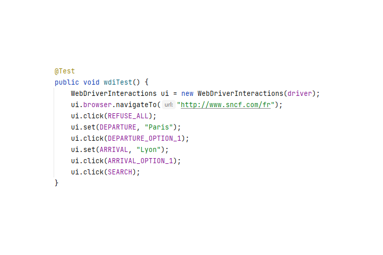

## Welcome to WebDriverInteractions Pages

WebDriverInteractions (wdi) is a set of functions you can integrate in your selenium test automation framework to manage automaticaly several technical stuff like waits, scrolling and much more.

You have less to care about it, keeping the code clean and focused on the test purpose.

### Benefits in practice

| Case | Sélénium | WebDriverInteractions |
| ---- | -------- | --- |
| Element not present |  |  |

The example above is a real and common case where elements are displayed after the page loads.
In this situation we have to inform explicitely the web driver to wait for the elements before interacting with them.
Wdi will automatically perform basic check before interacting with the elements and in a lot of cases he doen'st need more information.

Additional examples are available in [wdi-ex-junit](https://github.com/simple4tests/wdi-ex-junit)

### Support or Contact

Having trouble with Pages? Check out our [documentation](https://docs.github.com/categories/github-pages-basics/) or [contact support](https://support.github.com/contact) and we’ll help you sort it out.
